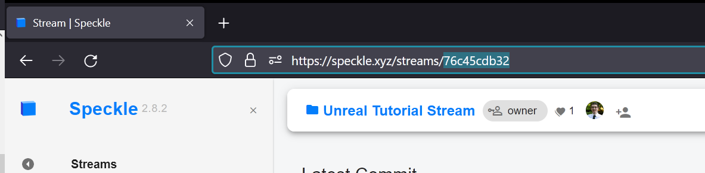
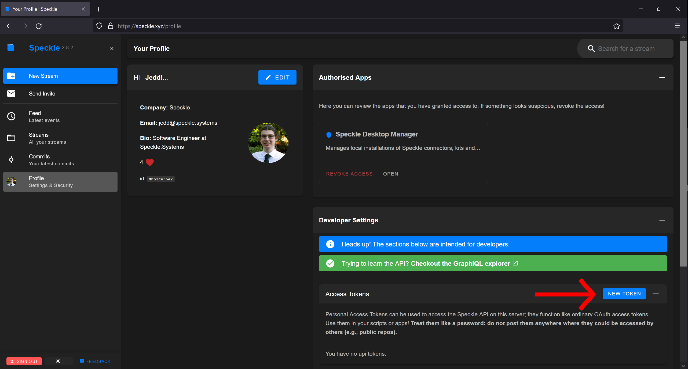
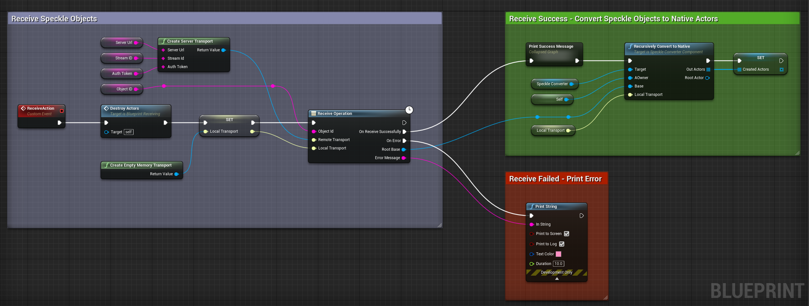
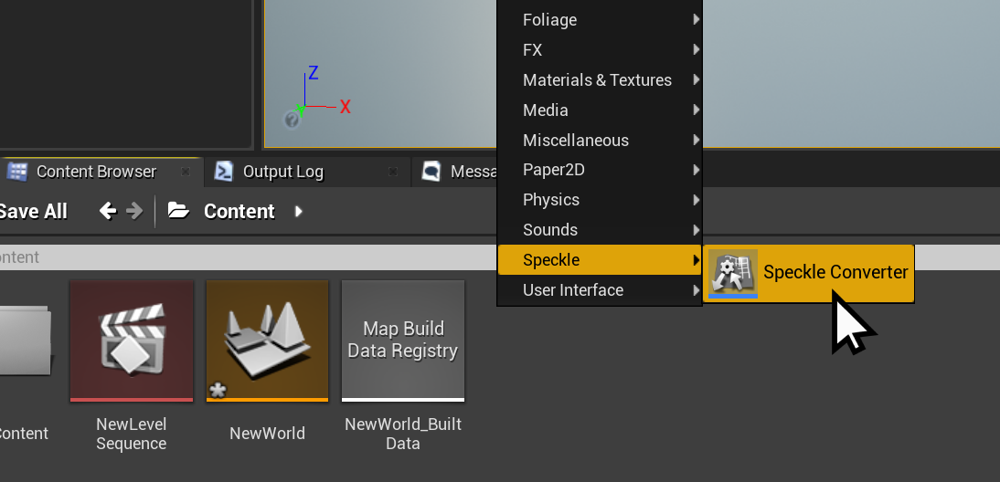
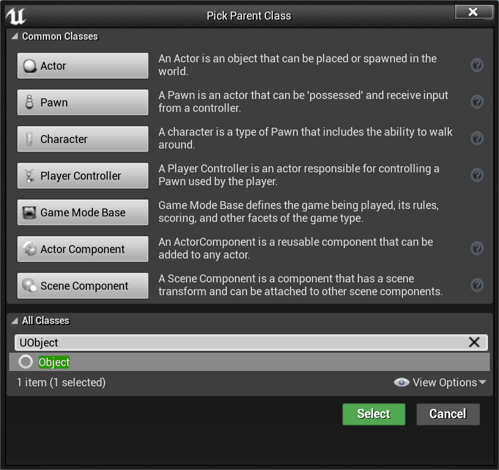
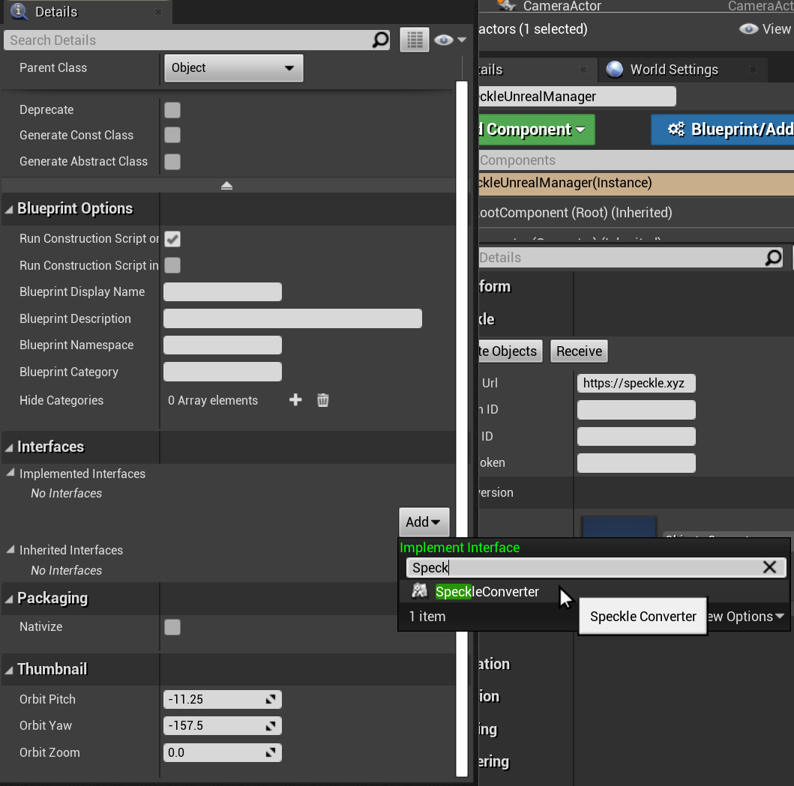
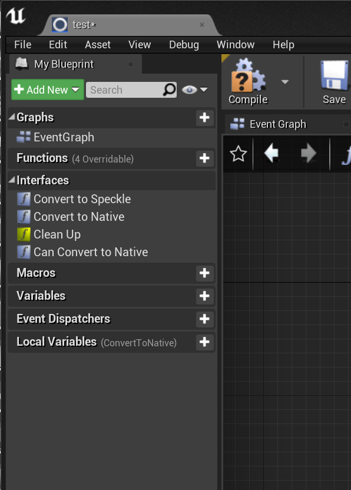

# Unreal

<div class="banner-ribbon">
  <span><b>Notice</b>: This user guide is based on the V2 Unreal connector.</span>
  <span class="next-gen">Next Gen connectors are coming soon, bringing significant changes to the documentation and features!</span>
  <span><b>Acknowledgement</b>: The Unreal connector is not yet on the V3 Next Gen roadmap.</span>
</div>

Our Unreal Engine Connector is in an **beta** stage of development. <br/>
Currently, we only support **receiving geometry** (sending support is on our roadmap). <br/>

We officially support Unreal Engine 4.27 and newer 5.X versions on Windows, Mac, and Linux platforms (other platforms untested).

Make sure to check out (and star :star: ) our Github repository: [https://github.com/specklesystems/speckle-unreal](https://github.com/specklesystems/speckle-unreal)
If you have any thoughts or suggestions about this plugin, you're welcome to [discuss them in our forum](https://speckle.community/).

<video width="761" height="454" controls>
  <source src="https://user-images.githubusercontent.com/45512892/187969471-3f548b17-3388-48ee-a07c-bd3a0ecf5149.mp4" type="video/mp4">
  Your browser does not support the video tag.
</video>

::: tip

Check out our dedicated [tutorials on Unreal](https://v1.speckle.systems/tag/unreal/)!

:::

_For additional resources, see Unreal's guides on [Installing Unreal Engine](https://docs.unrealengine.com/4.27/en-US/Basics/InstallingUnrealEngine/),
[Setting Up Visual Studio for Unreal Engine](https://docs.unrealengine.com/4.27/en-US/ProductionPipelines/DevelopmentSetup/VisualStudioSetup/),
and [Create a New Project](https://docs.unrealengine.com/4.27/en-US/Basics/Projects/Browser/)._

## Installation (Marketplace)

The Unreal Connector is packaged as a code plugin on the [Unreal Engine Marketplace](https://www.unrealengine.com/marketplace/en-US/product/speckle-for-unreal-engine). For most users, this installation method is recommended.

Once installed, it is necessary to **enable the Speckle plugin** for your project from the **`Edit → Plugins`** menu. Once enabled, you should be promoted to restart your project.

**That's It!** Your project can now use the Speckle plugin!

## Installation (Git)

For developers wanting to modify the source code, trial work-in-progress branches, and/or contribute changes back to the speckle-unreal repo, installing through [git](https://git-scm.com/) is prefered.

1. Git clone [this repo](https://github.com/specklesystems/speckle-unreal) into your project's `Plugins` directory (created as needed).

```
git clone https://github.com/specklesystems/speckle-unreal
```

3. Open your UE project (or restart the editor if you already have it opened). This will build the plugin in your environment.

If you encounter build issues, try building your project from VS/Rider directly. Look at the `Saved\Logs\` files for error messages,
and don't hesitate to reach out on our [community forums](https://speckle.community) for help!

## Usage (Editor)

The plugin includes an actor type named `Speckle Unreal Manager` that you can use to import objects from Speckle.

Here is how to use it:

1. In the `Place Actors` sidebar, search for *Speckle Unreal Manager* and add it to the world.

<center></center>

---

2. Select the `SpeckleUnrealManager` instance in the `World Outliner` sidebar and use the options presented in the `Speckle` category.

<center></center>


---

3. There are **two ways to import objects** using the `Speckle Unreal Manager` actor.

::: tip Import <b>a specific object</b> id, by specifying a <i>Server URL</i> + <i>Project id</i> + <i>Object id</i>

<p><details>
<summary>Expand</summary>

>**1.** Firstly, ensure the **"specify by object id" checkbox is checked**, and the **Sever URL** matches the Speckle server you are using (default [`https://app.speckle.systems`](https://app.speckle.systems))

>**2.** Enter the **Project ID**. This can be copied from the url of your project, and pasted into the "Project ID" property of your `Speckle Unreal Manager`.
><center></center>


>**3.** Enter the  **Object ID** of the object you want to receive.
>You can explore the objects in a project by using the [Speckle Web App](/user/web) for the Speckle server that you use.
><center> highlighting the object ID of the selected (root) object"/></center>

>**4. If the stream is private**, you will need to generate an **auth token**.
>To do so, head to your profile page [https://app.speckle.systems/profile](https://app.speckle.systems/profile), and generate a new Access Token (with all scopes)
><center></center>

</details></p>

:::


<center><b>OR</b></center>

::: tip Import <b>a speckle version</b>, by specifying a <i>Server URL</i> + <i>Auth Token</i>, and then select a <i>project</i> + <i>model</i> + <i>version</i> from the drop down menu.
<p><details>
<summary>Expand</summary>

>**1.** First, you must authenticate your Speckle account.<br/>
> Currently, this can only be done via an **auth token** (aka personal access token).<br/>
> To generate one, head to your profile page <a href="https://app.speckle.systems/profile">https://app.speckle.systems/profile</a>, and under "Access Token", generate a new token **with all scopes**.
><center></center>

>**2.** Paste the auth token into your `Speckle Unreal Manager` actor (also, ensure the `ServerUrl` is correct)

>**3.** Deselect the "specify by object id" option, and, assuming the url + token is valid, the drop down selections for `project`, `model`, and `version` will be available.
>
><center><video width="66%" loop controls autoplay muted><source src="./img-unreal/stream.branch.commit.selection.mp4" type="video/mp4">Your browser does not support the video tag.</video></center>

> (optional notes) The number of project/model/versions is capped, by default at 15, but this value can be adjusted under the advanced settings `options limit` value.
> If no options appear, then try deselecting, and reselecting the actor, and check the `Output Log` for warnings.

</details></p>

:::


::: warning IMPORTANT
⚠️ Treat your Personal Access Token **as a password**. If someone else has access to your auth token, they can access your Speckle data!
:::

---

4. After you set up the receive parameters, just click the `Receive` button. The specified object and all its children will be imported as Actors.<br/>
To set options on how the objects are converted, see the [object-conversion secion](./unreal.html#object-conversion).


## Usage (Blueprint)

Blueprint can be a powerful tool for implementing your own custom behaviours for receiving objects.

The receiving process can be performed using blueprint, doing it this way can allow for **extra flexibility** for performing additional actions with received data/converted actors.

Using blueprint to do this requires some basic understanding of how the plugin works.
- A `ServerTransport` is used to make a HTTP request to a Speckle server for the object (and its children).
It fetches JSON objects from the server, which are then stored in a local `Memory Transport`.
- The `ReceiveOperation` node handles the received objects, and deserializes them into Object Models (objects inheriting `UBase`).
- The `SpeckleConverterComponent` converts these objects into native actors/components.

An example of this process in Blueprint is provided in the `Plugins\speckle-unreal\Content\Examples` directory and looks like this:
<center></center>

Additionally, a number of Blueprint macro nodes are provided to fetch details about project/model/version/users.
Checkout our [dedicated tutorial on the topic](https://speckle.systems/tutorials/unreal-engine-blueprint-nodes-fetch-stream-branch-commit-info-and-more/), covering how to use the provided GraphQL nodes, and also how to easily develop your own query macros.


## Object Conversion

The `SpeckleConverterComponent` provides the conversion functionality for converting **Speckle objects to native UE Actors**.
However, this class does not contain specific conversion logic.<br/>
Instead, the **converter logic is modularised**, such that the conversion functions and settings for specific types are encapsulated **in their own class** implementing `ISpeckleConverter`.

> Please note that `ISpeckleConverter` here, is not the same as the `Speckle.​Core.​Kits.​ISpeckleConverter` in the .NET SDK.

Out of the box, the plugin provides converters for the following conversions:

| Speckle Type |  | Native Type |
| ---: | :---: | :--- |
| [`Objects.Geometry.Mesh`](https://github.com/specklesystems/speckle-sharp/blob/main/Objects/Objects/Geometry/Mesh.cs) | → | [Static Mesh Component](https://docs.unrealengine.com/4.27/en-US/API/Runtime/Engine/Components/UStaticMeshComponent/) /<br/> [Procedural Mesh Component](https://docs.unrealengine.com/4.27/en-US/API/Plugins/ProceduralMeshComponent/UProceduralMeshComponent/) |
| [`Objects.Geometry.PointCloud`](https://github.com/specklesystems/speckle-sharp/blob/main/Objects/Objects/Geometry/Pointcloud.cs) | → | [LiDAR Point Cloud](https://docs.unrealengine.com/4.27/en-US/WorkingWithContent/LidarPointCloudPlugin/LidarPointCloudPluginReference/) |
| [`Objects.Other.BlockInstance`](https://github.com/specklesystems/speckle-sharp/blob/main/Objects/Objects/Other/Block.cs) | → | Actor with Transform |
| [`Objects.BuiltElements.View`](https://github.com/specklesystems/speckle-sharp/blob/main/Objects/Objects/BuiltElements/View.cs) | → | Camera |
| [`Speckle.Core.Models.Collection`](https://github.com/specklesystems/speckle-sharp/blob/main/Core/Core/Models/Collection.cs) | → | EmptyActor |

> `StaticMeshConverter` and `ProceduralMeshConverter` are mutually exclusive, and for most users we recommend using static meshes (default).

Due to the nature of Unreal Engine, it is necessary to offer **options/settings for how objects are converted**.
So each `ISpeckleConverter` can also expose **properties that can be set** from within the editor, or from BP/C++.
This structure is distinctly different from other connectors, which often have one large conversion class that holds many conversions, and provide few (if any) settings.

Using the `StaticMeshConverter` as an example, you can see that it exposes several settings, such as the type of actor to create, and mesh build settings.

<video width="100%" loop controls autoplay muted>
  <source src="./img-unreal/converter-settings.mp4" type="video/mp4">
Your browser does not support the video tag.
</video> 


Out of the box, `SpeckleConverterComponent`s will be setup with a set of default converters.
For most users, there is no further configuration required.
However you can create your own instances of specific `ISpeckleConverter`s through the assets in the Content, and then assign them to the converter component.
This can be done by right clicking and creating a new converter of a specified type.
<center></center>

You can create your own custom converters in BP/C++ (see [Creating Custom Conversion](./unreal.html#creating-custom-conversion) docs)

### Mesh Converters

Speckle-Unreal provides two types of mesh converters:
1. [<code style="color: brown">ProceduralMeshConverter</code>](https://github.com/specklesystems/speckle-unreal/blob/main/Source/SpeckleUnreal/Public/Conversion/Converters/ProceduralMeshConverter.h):
   - Creates a `UProceduralMeshComponent`.
   - Slightly faster to convert, and allow run-time editing of vertices/faces.
   - Slowest to render, can't use baked lighting.
2. [<code style="color: brown">StaticMeshConverter</code>](https://github.com/specklesystems/speckle-unreal/blob/main/SpeckleUnrealProject/Plugins/SpeckleUnreal/Source/SpeckleUnreal/Public/SpeckleUnrealStaticMesh.h):
   - Creates a `UStaticMeshComponent`.
   - Mesh vertices/faces/etc can't be edited easily (needs to be rebuilt).
   - Faster to render.
   - Built meshes can be saved as assets, allowing levels to be reloaded.
   - Additional Editor only build process allows for baked lighting, extra path-tracing options, and optimised lighting.

For most users we recommend using Static Meshes because they are more optimised for rendering and can be saved to a level.
Static Meshes can be used during runtime or editor mode, but editor only build process will only be available with editor access.

### Material Converter


As a tool, Unreal shines when it comes to producing **beautiful, photorealistic renders** of scenes.
This has significant value for Speckle users as a tool for producing high quality and real-time demonstrations, animations, and XR experiences.

For some users, the simple flat shaded PBR materials converted using an object's [<code style="color: #144bca">RenderMaterial</code>](https://github.com/specklesystems/speckle-sharp/blob/main/Objects/Objects/Other/RenderMaterial.cs) will be all they want.

Many users, however, want to use **textured materials**, after all, Unreal excels in photorealism, and high quality materials are a significant part of that.

**The Material Overrides feature** of the `MaterialConverter` addresses this need, as it enables a semi-automated workflow for applying textured materials to received geometry.


Speckle's [<code style="color: #144bca">Objects</code>](https://speckle.guide/dev/objects.html) kit supports PBR materials through
the [<code style="color: #144bca">RenderMaterial</code>](https://github.com/specklesystems/speckle-sharp/blob/main/Objects/Objects/Other/RenderMaterial.cs) property of Speckle meshes.
When receiving meshes with a `RenderMaterial`, the `MaterialConverter` will create a [`MaterialInstance`](https://docs.unrealengine.com/4.26/en-US/API/Runtime/Engine/Materials/UMaterialInstance/)s which are applied to converted meshes.

::: tip

 Unreal has integration with [Quixel](https://quixel.com/)'s Megascans, a library of high-quality materials and assets that are free to use inside of Unreal Engine.

:::

#### How are Materials Converted

The `MaterialConverter` exposes a few properties for defining the base/parent material of the materials created.
Opaque materials will be converted as instances of `BaseMeshOpaqueMaterial`.
And transparent materials will be converted as instances of `BaseMeshTransparentMaterial`.

By default, these base materials are simple materials with opaque/translucent shader models respectively.
Both have several properties exposed (see screenshot), and during the conversion process,
these properties are set with the values from the `RenderMaterial`.

The default opaque material "SpeckleMaterial", looks like this:
<center></center>

And the default translucent material "SpeckleGlassMaterial", looks like this:
<center></center>

These base materials are exposed as properties of the converter, and can be changed from within the editor (or from BP/C++) to a custom material.

#### Overriding/Substituting Converted Materials

Speckle does **not currently** support sending/receiving textured materials.
However, we do provide a way to automatically apply native Unreal materials while receiving objects from Speckle.

Converted materials can be overridden with custom materials in two ways.

- **By Name** - The `RenderMaterial.name` will be matched against materials in the `MaterialsOverridesByName` array.
- **By Id** - The `RenderMaterial.id` will be by key with materials in the `MaterailOverridesById` map.

<center></center>

Screenshot of material overrides **By ID** in the details panel of the default `MaterialConverter` instance.
Materials with the ID `f5f7ebd4a...` will use this material instead of converting one from the object's `RenderMaterial`.

<center></center>

Screenshot of material overrides **By Name** in the details panel of the default `MaterialConverter` instance..
Materials with the name `Mossy_Grass` will use this material instead of converting one from the object's `RenderMaterial`.

#### Material Priorities

Material priority (high to low).

1. A material in `OverridesById` that matches by Id.
2. A material in `OverridesByName` that matches by Name.
3. A material cached from a previous receive operation.
4. A material asset in the `/Game/Speckle/Materials/{id}` package. (i.e. from a previous receive, but not cached, or from a strategically placed asset)
5. A material converted from `RenderMaterial` of the Mesh.
6. Finally, if all else fails, the `DefaultMaterial` set in the `MaterialConverter` will be used.

> Note: If there is no material on an object, we do not fall back to the parent's material like previous versions of this connector.
We are aware this may cause unexpected behaviour. This issue will be addressed.

#### Limitations

- In order to use textured materials, meshes need to have **Texture coordinates** (UV coordinates). Currently, Texture coordinates are only outputted from Rhino, Blender, and Sketchup connectors. (More connectors will receive support shortly! see [issue](https://github.com/specklesystems/speckle-sharp/issues/797). The Unreal Connector does **not** generate texture coordinates for you.
  Having UV coordinates also has other advantages for baked lighting.
- **Textures cannot be sent/received through Speckle**, only flat colours and simple PBR properties. Texture support is on our roadmap, but there are several techincal chalanges to overcome before this is possible.


### Developing Custom Conversion 

As previously mentioned, `ISpeckleConverter` classes can expose properties, such as the type of Actor to create, whether to create an asset, or build settings etc.

If this doesn't satisfy your needs, there are a few ways to further customise conversion.

  1. You can extend an existing converter, and re-implement specific functions.
  2. You can write a completely custom `ISpeckleConverter` class and add an instance to your `SpeckleConverterComponent`
  3. You can extend the `SpeckleConverterComponent` to customise more generally how objects are converted and actors attached.
  
Converters can be created in either C++ or Blueprint.


::: tip Tutorial

We have a tutorial for adding conversion functions for a custom Object Model

See [tutorial](https://speckle.systems/tutorials/unreal-developing-custom-conversion-logic/)

:::


#### Custom Object Models 

Object Models in the Unreal plugin function the same as the Object Models in .NET.

Out of the box, the Speckle for Unreal plugin provides several Object Models.
These classes can be found in `speckle-unreal\Source\SpeckleUnreal\Public\Objects` and are all subclasses of the `UBase` type.
For the most part, these classes are direct ports of the corresponding .NET classes from our Objects kit.
For example `Mesh`, and `BlockInstance`.

An Object Model is required in order to convert Speckle objects.
If you are looking to convert a type that we don't provide an Object Model, creating one is simple.

This process is very similar to defining an object model in the .NET and PY SDKs,
But be aware of certain limitations:
 1. The UE plugin **does not provide a reflection based (de)serializer**.
   Object Models implement their own (de)serialization logic in the form of manually parsing JSON properties.
 2. **Only certain Object Models are provided** out of the box, while most are direct ports of Objects kit, some are not!
 4. The Speckle Type is defined in the Object Model's constructor, not by its Namespace like in .NET.
 5. Units are applied while parsing (rather than ToNative conversion - subject to change)

To implement your own Unreal Object Model, simply create a new class inheriting from `UBase`.
Add your properties, and implement the `Parse` method to set these properties from the JSON object. 


```cpp
bool UMyObjectModel::Parse(const TSharedPtr<FJsonObject> Obj, const TScriptInterface<ITransport> ReadTransport)
{
	if(!Super::Parse(Obj, ReadTransport)) return false;

	// Add your own JSON parsing here!
	// Remove explicit properties from DynamicProperties array
	
	// Simple example of parsing an optional number property:
	if(Obj->TryGetNumberField("myProperty", MyProperty)) DynamicProperties.Remove("myProperty");
	
	// Simple example of parsing an required number property:
	if(!Obj->TryGetNumberField("myProperty", MyProperty)) return false; // Return false on error, rather than fatal assertions
	DynamicProperties.Remove("myProperty");
	
	//Return true if parsed successfully
	return true;
}
```

For further reference, see `URenderMaterial` for an example, see `UMesh` for a more advanced example.
`UConversionUtils` provides helper methods for dechunking / dereferencing Speckle objects.

> Currently, Unit scaling is applied during Parsing (not conversion). This is subject to change!

In the future, we may consider creating a proper deserializer that uses reflection, this would mean Object Models can be deserialized  without developers having to write these Parse methods.
There are several technical challenges for us to solve before this is possible. <br/>
Feel free to open a discussion on [our forums](https://speckle.community).

#### Creating Converters (C++)


A custom converter can be defined by creating a `UObject` class that implements `ISpeckleConverter`.
You must implement the `ConvertToNative` and `CanConverToNative` methods.


```cpp

UCLASS(BlueprintType, Blueprintable)
class SPECKLEUNREAL_API UMyConverter : public UObject, public ISpeckleConverter
{
	GENERATED_BODY()

public:
	virtual UObject* ConvertToNative_Implementation(const UBase* SpeckleBase, UWorld*, TScriptInterface<ISpeckleConverter>&) override;
	
	virtual bool CanConvertToNative_Implementation(TSubclassOf<UBase> BaseType) override;

}
```

Most likely, instead of jamming the actual conversion code in the `ConvertToNative` function, it is best to contain that in a separate function.
But this class can be implemented however you want!
The `AvailableConverters` parameter object is a reference to the master aggregate  converter, and we can use this if we need to convert other Speckle Objects, and want to reuse conversion logic from another converter.
The `StaticMeshConverter` for example, will use the `AvailableConverters` to convert a `RenderMaterial`.

```cpp
UObject* UMyConverter::ConvertToNative_Implementation(const UBase* SpeckleBase, UWorld* World, TScriptInterface<ISpeckleConverter>& AvailableConverters)
{
	const UMyObjectModel* m = Cast<UMyObjectModel>(SpeckleBase);
	
	if(m == nullptr) return nullptr;
	
	return MyObjectToNative(m);
}

AActor* UMyConverter::MyObjectToNative(const UMyObjectModel* MyObject, UWorld* World)
{
	// Conversion logic here!!
	// Convert MyObject into an Actor that we return
}
```

An optional `CleanUp` method can be implemented, which is used to clear any cached objects / any additional clean up that needs to be done between receive operations.

#### Creating Converters (Blueprint)

In the same way as with C++, converters can also be implemented using Blueprint.
First create a new Blueprint Inheriting `UObject`

<center></center>

Under *Class Settings* add `ISpeckleConverter` to the *Implemented Interfaces* list.

<center></center>

Finally, implement your conversion logic in the required functions.

<center></center>
