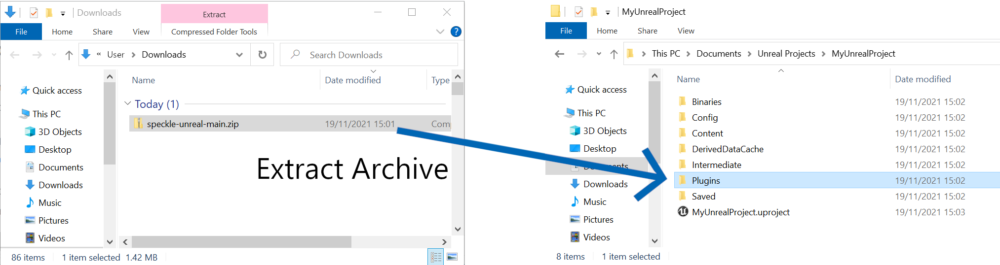
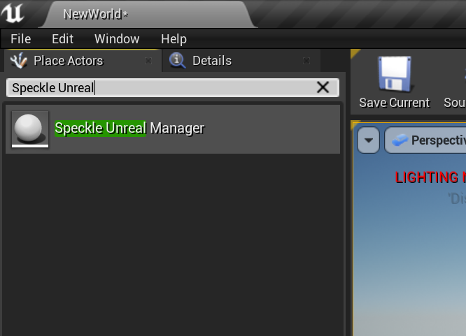
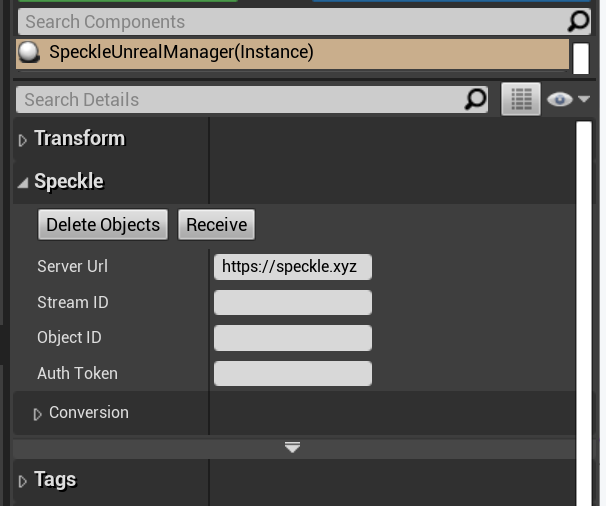
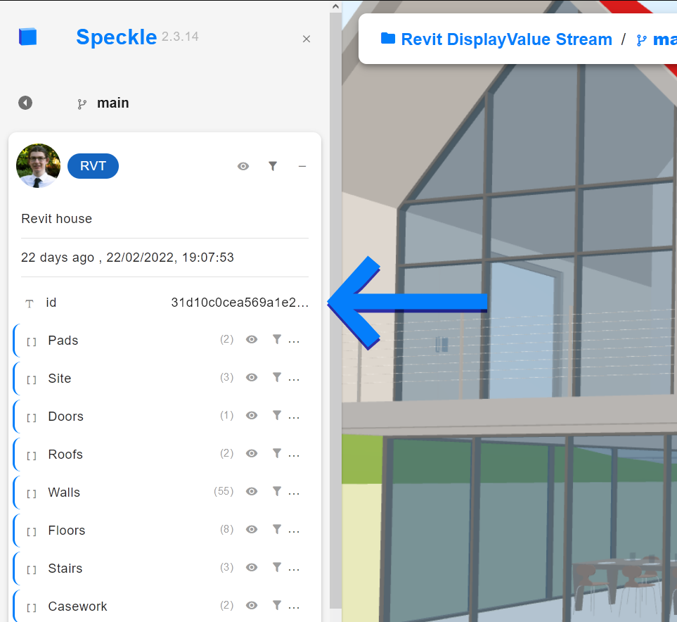
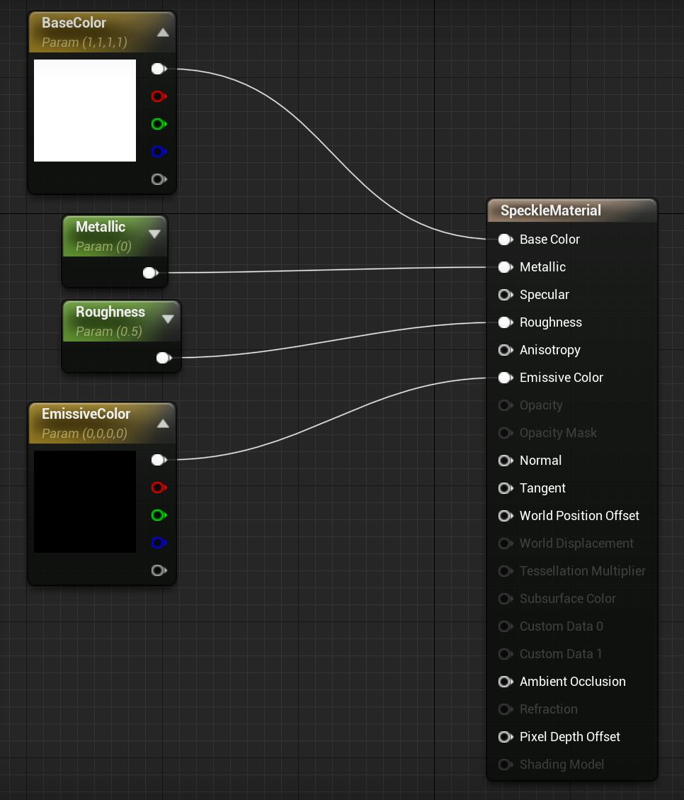
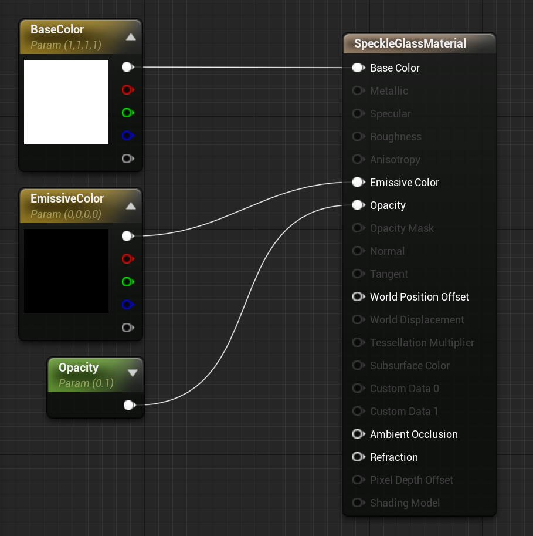
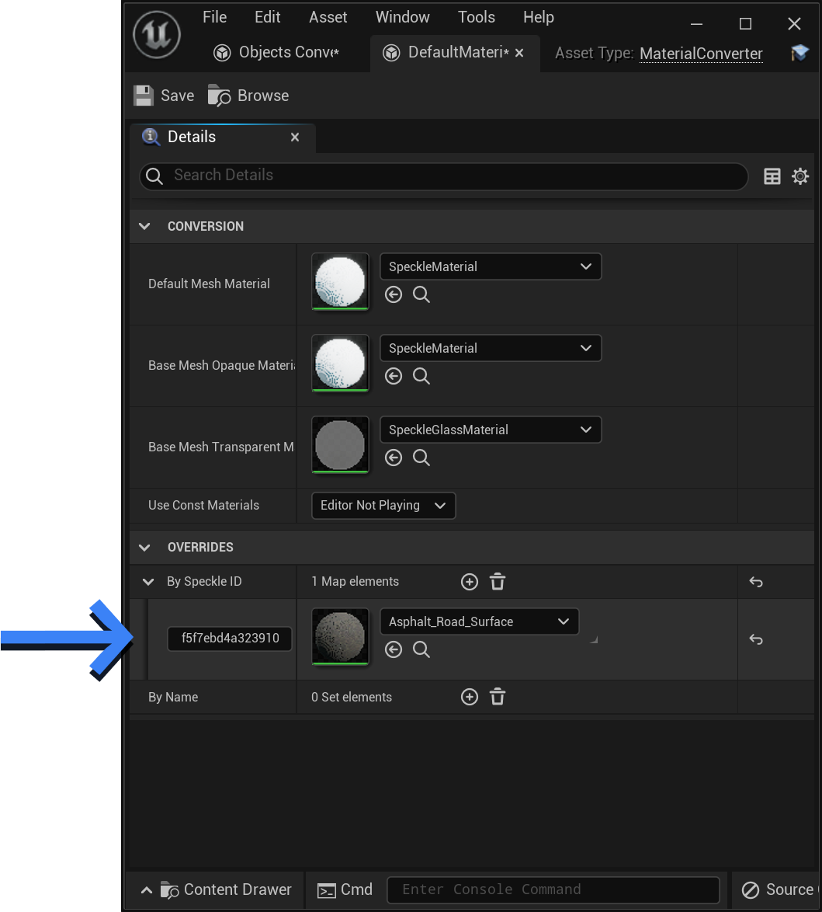
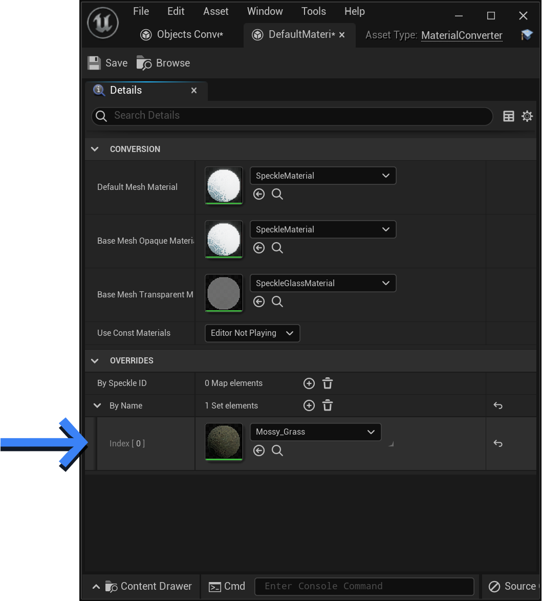

# Unreal

Our Unreal connector is in an early stage of development.
It supports receiving meshes from Speckle in Unreal Engine 4.

Make sure to check out (and star :star: ) our Github repository: [https://github.com/specklesystems/speckle-unreal](https://github.com/specklesystems/speckle-unreal)

<video width="761" height="454" controls>
  <source src="https://user-images.githubusercontent.com/2551138/114720093-61403e00-9d40-11eb-8045-6e8ca656554d.mp4" type="video/mp4">
  Your browser does not support the video tag.
</video> 

::: tip 

Check out our dedicated [tutorials on Unreal](https://speckle.systems/tag/unreal/)!

:::

## Installation
The Unreal connector is packaged as an Unreal Engine 4 plugin that is currently only available through Github. To use it in your project:
1. Download and extract the `speckle-unreal` repository archive from [https://github.com/specklesystems/speckle-unreal/archive/refs/heads/master.zip](https://github.com/specklesystems/speckle-unreal/archive/refs/heads/master.zip) (or clone the repository using `git` tools)

2. Go to the `SpeckleUnrealProject/Plugins` directory and copy the `SpeckleUnreal` plugin directory to your project's `Plugins` directory (if your project directory doesn't contain a directory called `Plugins`, you should create it)

   
3. Open your UE4 project (or restart the editor if you already have it opened). This will build the plugin in your environment.

**That's It!** Your project can now use the Speckle plugin!

## Usage
The plugin includes an actor type named `Speckle Unreal Manager` that you can use to import objects from Speckle.

Here is how to use it:

1. In the `Place Actors` sidebar, search for Speckle Unreal Manager and add it to the world.

2. Select the `SpeckleUnrealManager` instance in the `World Outliner` sidebar and use the options presented in the `Speckle` category

3. Currently, we require an explicit ObjectID to import. You can explore the objects in a stream by using the [Speckle Web App](/user/Web) for the Speckle server that you use.

4. If your Speckle Stream is not public, you must generate a [Personal Access Token](/dev/apps-auth.html#personal-access-tokens) and set it in the `Auth Token` configuration option.

::: tip IMPORTANT
   Treat your Personal Access Token as a password. If someone else has access to your auth token, they can access to your Speckle data.
:::

5. After you set up the import parameters, just click the `Import Speckle Object` button. The specified object and all its children will be important as mesh actors.

## General Notes

This plugin is in early stages of development. If you have any thoughts or suggestions about this plugin, you're welcome to [discuss them in our forum](https://speckle.community/).

## Material Conversion

<code style="color: #144bca">Blue</code> snippets refer to **[Speckle Objects](https://github.com/specklesystems/speckle-sharp)** classes.

<code style="color: red">Red</code> snippets refer to **Unreal Engine** classes.

<code style="color: brown">Brown</code> snippets refer to **[Speckle Unreal](https://github.com/specklesystems/speckle-unreal/)** classes.

---

### Conversion of Materials

Speckle's [<code style="color: #144bca">Objects</code>](https://speckle.guide/dev/objects.html) kit supports PBR materials through the [<code style="color: #144bca">RenderMaterial</code>](https://github.com/specklesystems/speckle-sharp/blob/main/Objects/Objects/Other/RenderMaterial.cs) property of Speckle meshes.

When receiving meshes with a [<code style="color: #144bca">RenderMaterial</code>](https://github.com/specklesystems/speckle-sharp/blob/main/Objects/Objects/Other/RenderMaterial.cs), the Unreal connector will create [<code style="color: red">UMaterialInstance</code>](https://docs.unrealengine.com/4.26/en-US/API/Runtime/Engine/Materials/UMaterialInstance/)s which are applied to converted meshes.

#### How are materials converted

For opaque materials, a [<code style="color: red">UMaterialInstanceDynamic</code>](https://docs.unrealengine.com/4.27/en-US/API/Runtime/Engine/Materials/UMaterialInstanceDynamic/) is created as child material instance of [<code style="color: brown">ASpeckleUnrealManager::BaseMeshOpaqueMaterial</code>](https://github.com/specklesystems/speckle-unreal/blob/master/SpeckleUnrealProject/Plugins/SpeckleUnreal/Source/SpeckleUnreal/Public/SpeckleUnrealManager.h). For translucent materials (with an opacity <1), [<code style="color: brown">ASpeckleUnrealManager::BaseMeshTransparentMaterial</code>](https://github.com/specklesystems/speckle-unreal/blob/master/SpeckleUnrealProject/Plugins/SpeckleUnreal/Source/SpeckleUnreal/Public/SpeckleUnrealManager.h) is used as the parent instead.

By default, these base materials are a simple [<code style="color: red">UMaterial</code>](https://docs.unrealengine.com/4.27/en-US/API/Runtime/Engine/Materials/UMaterial/)s with opaque/translucent shader models respectively. Both have several properties exposed (see screenshot), and during the conversion process, these properties are set with the values from the [<code style="color: #144bca">RenderMaterial</code>](https://github.com/specklesystems/speckle-sharp/blob/main/Objects/Objects/Other/RenderMaterial.cs)¹.

SpeckleMaterial, the default `BaseMeshOpaqueMaterial`.

SpeckleGlassMaterial, the default `BaseMeshTransparentMaterial`.

By specifying a custom base material, users can have complete control over how these properties are assigned. 

> ¹Dev Note  
> 	<code style="color: brown">URenderMaterial</code> is a C++ port of [<code style="color: #144bca">Objects.Other.RenderMaterial</code>](https://github.com/specklesystems/speckle-sharp/blob/main/Objects/Objects/Other/RenderMaterial.cs). [<code style="color: #144bca">RenderMaterial</code>](https://github.com/specklesystems/speckle-sharp/blob/main/Objects/Objects/Other/RenderMaterial.cs) json is parsed into <code style="color:brown">URenderMaterial</code> by <code style="color:brown">UMaterialConverter</code>. A [<code style="color: red">UMaterialInstanceDynamic</code>](https://docs.unrealengine.com/4.27/en-US/API/Runtime/Engine/Materials/UMaterialInstanceDynamic/) is created from a base [<code style="color: red">UMaterialInterface</code>](https://docs.unrealengine.com/4.27/en-US/API/Runtime/Engine/Materials/UMaterialInterface/) before being assigned the values from <code style="brown">URenderMaterial</code>. [<code style="color: brown">ASpeckleUnrealManager::CreateMaterial()</code>](https://github.com/specklesystems/speckle-unreal/blob/master/SpeckleUnrealProject/Plugins/SpeckleUnreal/Source/SpeckleUnreal/Public/SpeckleUnrealManager.h) gets or creates the correct material that should be applied to a mesh.
    

### Overriding Converted Materials

Speckle does not currently support textured materials.

Because of this, often users want to use their own textured [<code style="color: red">UMaterialInterface</code>](https://docs.unrealengine.com/4.27/en-US/API/Runtime/Engine/Materials/UMaterialInterface/)s instead of the ones converted from the [<code style="color: #144bca">RenderMaterial</code>](https://github.com/specklesystems/speckle-sharp/blob/main/Objects/Objects/Other/RenderMaterial.cs).  Converted [<code style="color: red">UMaterialInstance</code>](https://docs.unrealengine.com/4.27/en-US/API/Runtime/Engine/Materials/UMaterialInterface/)s can be overridden with custom [<code style="color: red">UMaterialInterface</code>](https://docs.unrealengine.com/4.27/en-US/API/Runtime/Engine/Materials/UMaterialInterface/)s in two ways.

- **By Name** - The [<code style="color: #144bca">RenderMaterial.Name</code>](https://github.com/specklesystems/speckle-sharp/blob/main/Objects/Objects/Other/RenderMaterial.cs) will be matched by name, against [<code style="color: red">UMaterialInterface</code>](https://docs.unrealengine.com/4.27/en-US/API/Runtime/Engine/Materials/UMaterialInterface/)s in the [<code style="color: brown">ASpeckleUnrealManager::MaterialsOverridesByName</code>](https://github.com/specklesystems/speckle-unreal/blob/master/SpeckleUnrealProject/Plugins/SpeckleUnreal/Source/SpeckleUnreal/Public/SpeckleUnrealManager.h) `TArray`.
- **By Id** - The Speckle ID of the [<code style="color: #144bca">RenderMaterial</code>](https://github.com/specklesystems/speckle-sharp/blob/main/Objects/Objects/Other/RenderMaterial.cs) will be matched against [<code style="color: red">UMaterialInterface</code>](https://docs.unrealengine.com/4.27/en-US/API/Runtime/Engine/Materials/UMaterialInterface/) values in [<code style="color: brown">ASpeckleUnrealManager::MaterialsOverridesById</code>](https://github.com/specklesystems/speckle-unreal/blob/master/SpeckleUnrealProject/Plugins/SpeckleUnreal/Source/SpeckleUnreal/Public/SpeckleUnrealManager.h)`TMap` by key.

Screenshot of material overrides **By ID** in details panel of <code style="color:brown">ASpeckleUnrealManager</code>.
Materials with the ID `280559dd3...` will use this material instead of converting one from the object's <code style="color: #144bca">RenderMaterial</code>.

Screenshot of material overrides **By Name** in details panel of <code style="color:brown">ASpeckleUnrealManager</code>. 
Materials with the name `Mossy_Grass` will use this material instead of converting one from the object's `RenderMaterial`.

#### Material Priorities

Material priority (high to low).

1. A [<code style="color: red">UMaterialInterface</code>](https://docs.unrealengine.com/4.27/en-US/API/Runtime/Engine/Materials/UMaterialInterface/) in [<code style="color: brown">ASpeckleUnrealManager::MaterialOverridesById</code>](https://github.com/specklesystems/speckle-unreal/blob/master/SpeckleUnrealProject/Plugins/SpeckleUnreal/Source/SpeckleUnreal/Public/SpeckleUnrealManager.h) that matches [<code style="color: #144bca">RenderMaterial</code>](https://github.com/specklesystems/speckle-sharp/blob/main/Objects/Objects/Other/RenderMaterial.cs)s by their Speckle ID.
2. A [<code style="color: red">UMaterialInterface</code>](https://docs.unrealengine.com/4.27/en-US/API/Runtime/Engine/Materials/UMaterialInterface/) in [<code style="color: brown">ASpeckleUnrealManager::MaterialOverridesByName</code>](https://github.com/specklesystems/speckle-unreal/blob/master/SpeckleUnrealProject/Plugins/SpeckleUnreal/Source/SpeckleUnreal/Public/SpeckleUnrealManager.h) that matches [<code style="color: #144bca">RenderMaterial</code>](https://github.com/specklesystems/speckle-sharp/blob/main/Objects/Objects/Other/RenderMaterial.cs)s by name.
3. Converted [<code style="color: #144bca">RenderMaterial</code>](https://github.com/specklesystems/speckle-sharp/blob/main/Objects/Objects/Other/RenderMaterial.cs) set on [<code style="color: #144bca">Mesh</code>](https://github.com/specklesystems/speckle-sharp/blob/main/Objects/Objects/Geometry/Mesh.cs) Speckle object.
4. Converted [<code style="color: #144bca">RenderMaterial</code>](https://github.com/specklesystems/speckle-sharp/blob/main/Objects/Objects/Other/RenderMaterial.cs) on [<code style="color: #144bca">Mesh</code>](https://github.com/specklesystems/speckle-sharp/blob/main/Objects/Objects/Geometry/Mesh.cs)'s parent Speckle object. (<code style="color:brown">FallbackMaterial</code>).²
5. [<code style="color: brown">ASpeckleUnrealManager::DefaultMeshMaterial</code>](https://github.com/specklesystems/speckle-unreal/blob/master/SpeckleUnrealProject/Plugins/SpeckleUnreal/Source/SpeckleUnreal/Public/SpeckleUnrealManager.h)

> ²Dev Note  
> Depending on the source application, the <code style="color:#144bca">RenderMaterial</code> could a property of the <code style="color:#144bca">Mesh</code> object, or of the <code style="color:#144bca">Mesh</code>es parent. This is why both cases 3 and 4 (Above) exist.
    

### Limitations

- I order to use textured materials, meshes need to have **Texture coordinates** (UV coordinates). Currently, Texture coordinates only outputted from Blender and Sketchup connectors. (More connectors will receive support shortly!). The Unreal connector does **not** generate texture coordinates for you.
    
    Having UV coordinates also has other advantages for lighting.
    
- **Textures cannot be sent/received through Speckle**, only flat colours and simple PBR properties. Fully supporting textures could add significant value for interoperability between Unreal, Unity, Blender, Rhino, and Sketchup, however poses several technical challenges.
    
    Of course, Users are more than welcome to extend Speckle's Objects kit to include textures and their own custom properties to suite there needs.
    

### Motivation

As a tool, Unreal shines when it comes to producing **beautiful, photorealistic renders** of scenes. This has significant value for Speckle users as a tool for producing high quality and real-time demonstrations, animations, and XR experiences.

For some users, the simple flat materials converted using an object's [<code style="color: #144bca">RenderMaterial</code>](https://github.com/specklesystems/speckle-sharp/blob/main/Objects/Objects/Other/RenderMaterial.cs) will be all they want, and PBR properties are used by many of the connectors Speckle supports.

Many users, however, want to use **textured materials**, after all, Unreal excels in photorealism, and high quality materials are a significant part of that.

**The Material Overrides feature** of the Unreal connector addresses this need as it enables a semi-automated workflow for applying textured materials to received geometry.

It is worth mentioning, that Unreal has integration with [Quixel](https://quixel.com/), a library of high-quality materials and assets that are free to use inside of Unreal Engine.