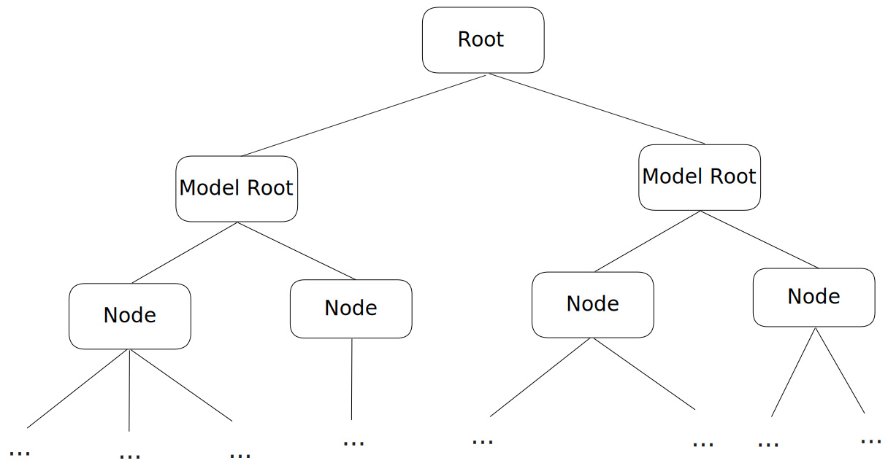

# Viewer Data

## World Tree
The viewer stores data in a hierarchical fashion inside a tree-like structure which we call `WorldTree`



Loading data into the viewer can be 100% customisable, so the structure of the tree is also up to the loader implementation, however when talking about the default Speckle loader, one important aspect of how we store data is that, direct children of `Root` will always be the root of a complete subtree which represents a loaded model.

A node inside the tree looks like the following:
```typescript
{
    model: NodeData
    children: Array<TreeNode>
    parent: TreeNode
}
```
And the `NodeData` model payload of a Node:
```typescript
{
    raw: { [prop: string]: any }
    children: TreeNode[]
    atomic: boolean
    subtreeId?: number
    renderView?: NodeRenderView
    instanced?: boolean
}
```
Each node will store any `raw` data that came in via the loader. In the SpeckleLoder's case it's the actual speckle object. The `atomic` property hints at whether we need to treat this node as a complete object (true) or just being part of another object (false). `subtreeId` is just an internally used property for search acceleration, and `instanced` tells if this node data is being used by multiple nodes. The `renderView` property is a very important property which holds the data required for everything rendering related. We will describe it in detail later on.

The `WorldTree` class provides functionality for adding, removing ,searching and walking the tree. It is the single source of truth for all the data in the viewer and it's the place to go for all data related operations.


## Loaders
The viewer provides a loader system which allows for virtually any data to be loaded in. The `SpeckleLoader` is an example of such loader that specialises on loading speckle data.

If we take a look at how the viewer loads data:
```typescript
loadObject(loader: Loader): Promise<void>
```
We see that it delegates the loading process to a `Loader` object that we specify. The `Loader` class is abstract and intentionally thin, requiring only three functions to exist in it's extensions: `load`, `cancel`, and `dispose`.

In order for data to correctly end up in the viewer's store, and all the builtin rendering features to work correctly, the loading process, regardless of how it's chosen to be implemented, needs to accomplish the following things:

1. Populate the viewer's `WorldTree` with nodes
2. Convert renderable incoming data into types the viewer can understand
3. Build a global `RenderTree`

Populating the viewer's tree can be very generic, so the viewer doesn't impose anything in this step. However, traditionally, we make use of a `Converter` which takes in raw data, and builds and adds tree nodes to the tree.

Once the tree is populated, we need a  way to turn renderable information contained in the tree in any form it may be in to something that the viewer understands how to render. This is where the `GeometryConverter` comes in. It's a thin abstract class again and any geometry converter needs to implement the following:
```typescript
public abstract getSpeckleType(node: NodeData): SpeckleType
public abstract convertNodeToGeometryData(node: NodeData): GeometryData
public abstract disposeNodeGeometryData(node: NodeData): void
```
The up to date types the viewer works with can be found [here](https://github.com/specklesystems/speckle-server/blob/631de589c5a78fc9891b3b50dbecb075e0661c90/packages/viewer/src/modules/loaders/GeometryConverter.ts#L4), however internally the viewer doesn't rely that much on these types, and they are mostly relevant at conversion time

The most important function than needs to implemented by any geometry converter is `convertNodeToGeometryData` which takes tree nodes and builds `GeometryData` objects for them, which allow the viewer to render the objects correctly.

Once a geometry converter is implemented, you don't need to call any of it's method on your own. Everything will be called automatically in step 3, where we build the `RenderTree`. A RenderTree is simply a subtree of the WorldTree (or the entirety of it) with added rendering-related functionality. In order to build a RenderTree:
```typescript
const geometryConverter = new MyGeometryConverter()
renderTree.buildRenderTree(geometryConverter)
```
More details on how to use the RenderTree will be provided later on, but to get a better idea, to hold of a `RenderTree` instance, you generally use the `WorldTree`
```typescript
public getRenderTree(subtreeId?: string): RenderTree
```
If no subtreeId is provided, the global RenderTree is returned. An important note here, is that a new render tree does not imply any kind of duplication. The render tree will use the existing nodes from the world tree that spawned it. Additionally, the world tree caches spawned render trees, so calling `getRenderTree` with the same id multiple times does not incur any performance overhead

For examples of using our loading system and concrete implementations of `Loader` and `GeometryConverter` you can have a look at :

* [Speckle loader and converter](https://github.com/specklesystems/speckle-server/tree/alex/API2.0/packages/viewer/src/modules/loaders/Speckle)
* [OBJ loader and converter (geometry only)](https://github.com/specklesystems/speckle-server/tree/alex/API2.0/packages/viewer/src/modules/loaders/OBJ)

Additionally, here is a live sandbox with the OBJLoader in use:

<iframe src="https://codesandbox.io/embed/pydvhz?view=Editor+%2B+Preview&module=%2Fpackage.json&hidenavigation=1"
     style="width:100%; height: 500px; border:0; border-radius: 4px; overflow:hidden;"
     title="Obj Loader"
     allow="accelerometer; ambient-light-sensor; camera; encrypted-media; geolocation; gyroscope; hid; microphone; midi; payment; usb; vr; xr-spatial-tracking"
     sandbox="allow-forms allow-modals allow-popups allow-presentation allow-same-origin allow-scripts"
></iframe>