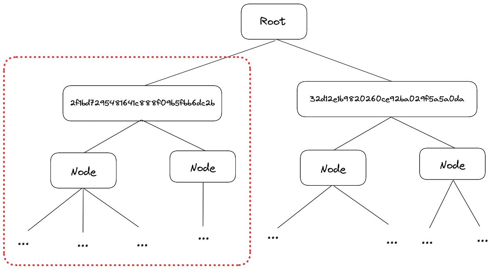

# Rendering

With the introduction of custom loaders, we've potentially broadened the scope of what the viewer could be used for, however our goal and purpose is still focusing on AEC related visualisation, with a strong bias towards speckle data. Because speckle data is organized in a certain way, the viewer creates some concepts and abstractions around it so that clients can use it efficiently.

One such abastraction is the `NodeRenderView`, which is intensely used by the viewer core as well as viewer extensions

## RenderViews
The nodes from the previously defined [WorldTree](/viewer/viewer-data/#worldTree) can contain any kind of data. Some of them contain rendering related data, like meshes, lines, points. A 'RenderView' of a node is just it's rendering related data from the viewer's point of view. The viewer will use render views for all rendering related operations instead of the node itself.

Across the viewer-core and viewer extensions, render views are required to be passed around for various entry points. 

All render viewers are accessible through the `RenderTree`


## Render Tree
The `RenderTree` concept was mentioned before in the [Loaders]('/viewer-data') chapter and now we'll take a closer look. 

A render tree is essentially just a wrapper around a parts (or the entire) world tree, with additional rendering related functionality. Here's how you get a render tree instance
```typescript
const renderTree = worldTree.getRenderTree('2f1bd7295481641c888f09b5fbb6dc2b')
```
The id you provide to `getRenderTree` represents the root of the render tree. So the call above will you get you the render tree highlighted in the image below.



You can omit an id, in which case a ful  render tree with all the nodes will be returned. 

Once you got hold of a render tree, you can start fetching render views
```typescript
const nodeId = '2f1bd7295481641c888f09b5fbb6dc2b'
const renderTree = worldTree.getRenderTree(nodeId)
// Get all render views starting from the root of the render tree
const node = worldTree.findId(nodeId)
const rvs = renderTree.getRenderViewsForNode(node)
// Define some material parameters
const materialData = {
    color: 0xee0022,
    opacity: 1,
    roughness: 1,
    metalness: 0,
    vertexColors: false,
}
// Apply material
viewer.setMaterial(rvs, materialData)
```


It's important to note that you should always get the minimum render tree for your needs. As in, it's probably easiest to just get the whole render tree each time, but keep in mind that if you're going through the tree, fetching render views, it's always better for that tree to be as small as possible