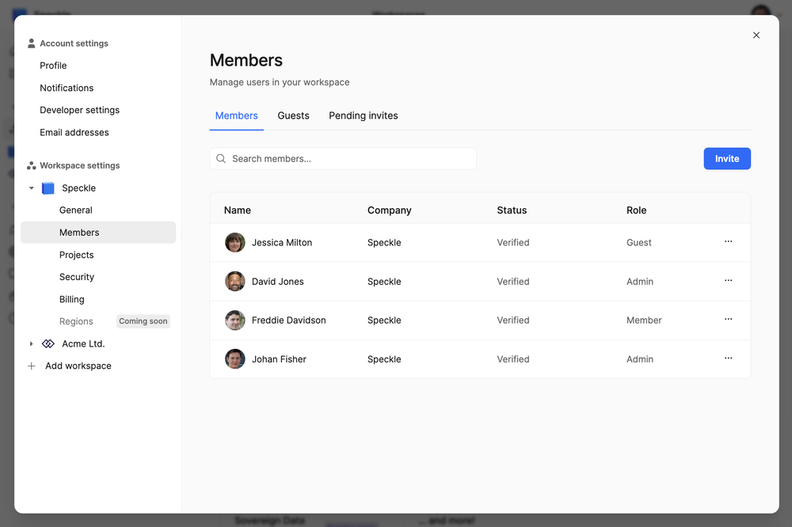
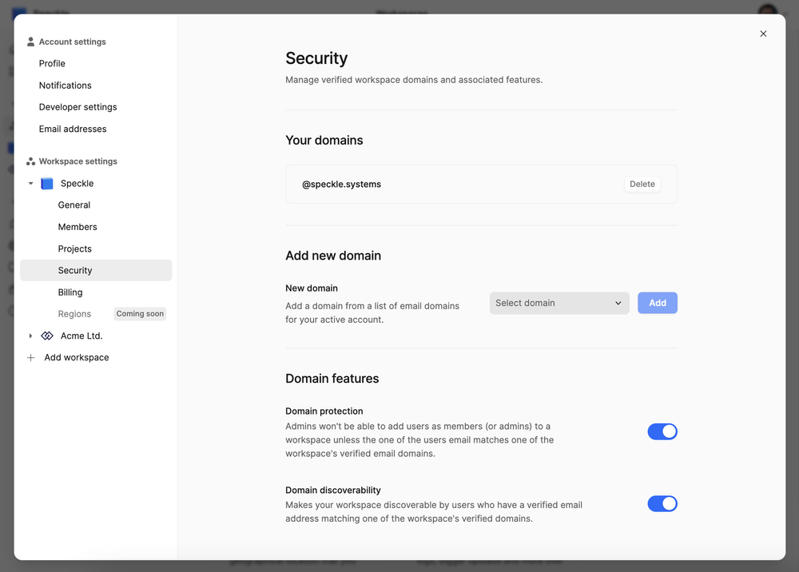
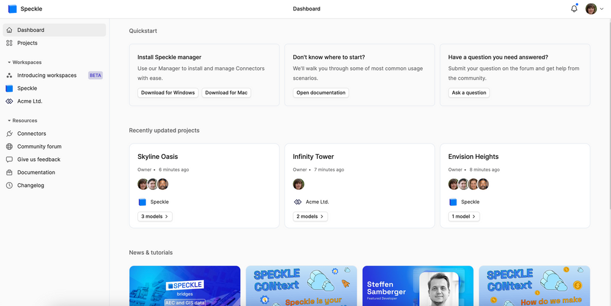
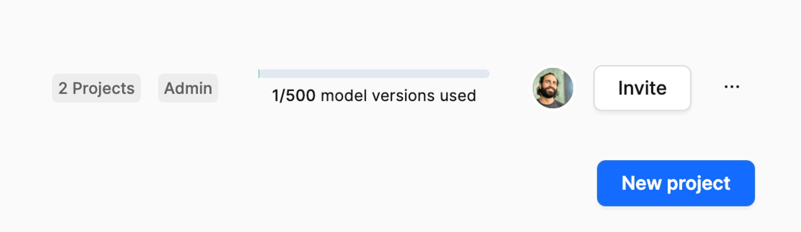

## Introducing Workspaces: Speckle for Teams

What began as a simple Grasshopper plugin for sharing 3D models has evolved into a transformative open-source platform addressing key pain points in the AEC industry. With this latest development, Speckle becomes **AEC’s first collaborative data hub**: your go-to solution for data connectivity, real-time collaboration, and workflow automation.

Being your AEC data hub means bringing your **tech stack**, **team**, and **projects** into one secure, centralised space—now with advanced project management features.

Let’s unpack what’s new!

### It’s Time to Gain More Control Over Your Projects

Whether you’re using Speckle solo or in teams, you’ve told us how much you value **data control** and [project management](https://speckle.systems/blog/speckle-project-management-made-easy/). Speckle is your data hub for connectivity and collaboration, offering a shared space for **data exchange**, **communication**, and **automation**. Now, we’re taking this even further with the launch of **Workspaces**.

<video src="https://v1.speckle.systems/content/media/2024/09/Workpaces-light-dark.mp4" poster="https://img.spacergif.org/v1/4070x2036/0a/spacer.png"  loop autoplay muted playsinline preload="metadata" style="background: transparent url('https://v1.speckle.systems/content/images/2024/09/media-thumbnail-ember1466.jpg') 50% 50% / cover no-repeat;"></video>

Workspaces provide a more secure and streamlined way to manage projects in real time. How? By giving you **control over your data**, **enhanced security**, and **data residency options**—while making life easier for you and your team.

If you thought Speckle was all about collaboration, you haven’t seen what Workspaces can do.

### Workspaces: A Deep Dive

We invite you to explore this [new product](https://app.speckle.systems/) with a fresh perspective. Workspaces are built for teams, designed to enhance group productivity with features like **improved security**, **granular permission management**, and **stronger collaboration**.

Previously, this level of functionality was only available by creating your own server or subscribing to our enterprise plan. With Workspaces, it’s just one click away.

#### Workspaces: Why It’s Important for Your Team

Workspaces are your virtual Speckle home, enabling your team to securely organise projects as needed.

#### Higher Control Over Project Accessibility

Workspace admins have complete visibility and control over members and projects. Admins can:

- Add members to a workspace, granting them access to all projects.
- Invite external collaborators as **guests**, with access limited to specific projects.

#### More Productive…and Secure

Workspaces can link with your organisation’s email domain, ensuring team members are automatically added to the right workspace.  

If **domain-based membership protection** is enabled, only users with compliant email addresses can become workspace members. Non-compliant users can still be invited as guests for secure collaboration.

#### Your Projects and Peers, All in One Place

Have a personal Speckle account but want to join a workspace with your work email? No problem! You can now link **multiple email addresses** to your Speckle account.

Using your email and workspace domain, you’ll easily find your allocated team workspace. This eliminates silos and saves time. Workspaces also automatically handle permissions, so you don’t need to worry about updating access when someone joins or leaves the team.

---

### Enterprise-Ready Features (Coming Soon)

In the coming months, we’ll introduce enterprise-grade features to meet stringent IT security requirements. These will include:

- **Data residency compliance**: Choose where your data is hosted to meet regulatory demands.
- **Service Level Agreements (SLA)**: Offering uptime guarantees and dedicated support.
- **SAML/Single Sign-On (SSO)**: Simplify login and access control.

::: tip
Workspaces are free to test while in beta. Once out of beta in November, you’ll need to upgrade to the Team Plan to continue using Workspaces.  
Here’s a summary of the plans launching in November:
:::

#### Free Plan
- Keep using Speckle as always—no changes here.
- Test Workspaces for free, with up to **500 model versions** included.

#### Team Plan
- Create a Workspace for your team for **£49 per user per month**.
- Includes **10 external collaborators (guests)** for free. Additional guest pricing:
  - **£5 per guest** for read-only access.
  - **£15 per guest** for read-and-write access.
- Unlimited model versions.

#### Enterprise Plan
- Custom pricing tailored to your needs.
- Contact us at <office@speckle.systems> to discuss your requirements.

---

Explore Workspaces today to experience better control, security, and collaboration in your AEC workflows. Visit the [Speckle Community Forum](https://speckle.community) for support and feedback, and let’s take your projects to the next level!
